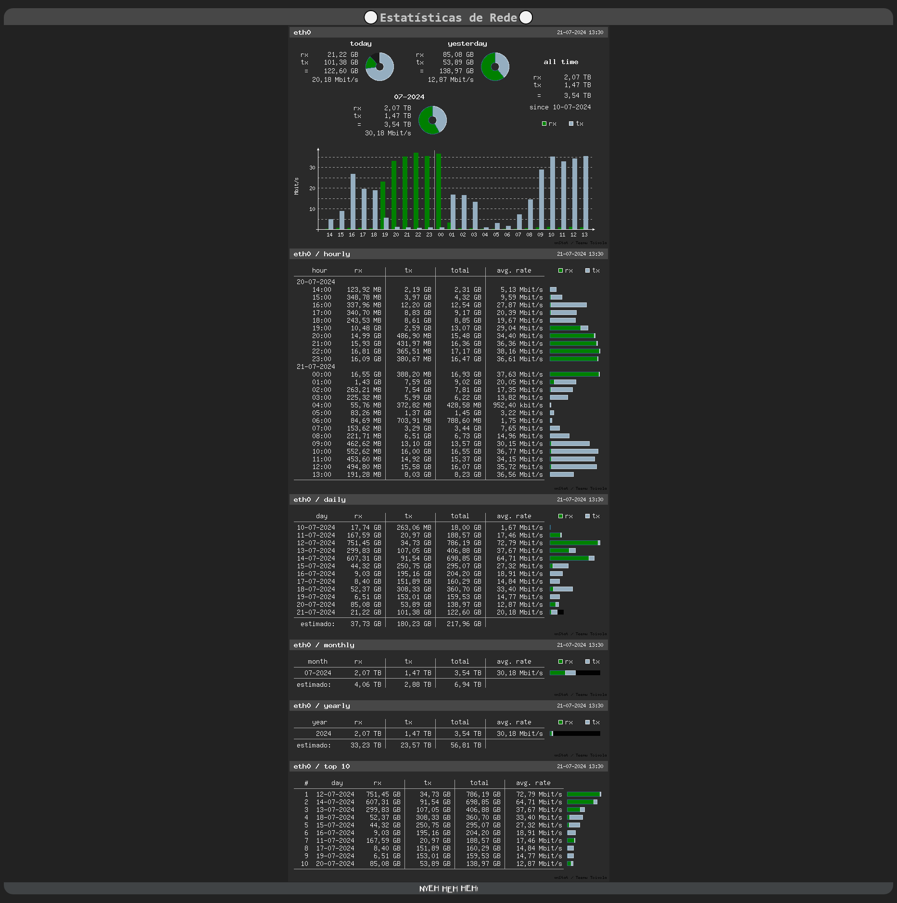
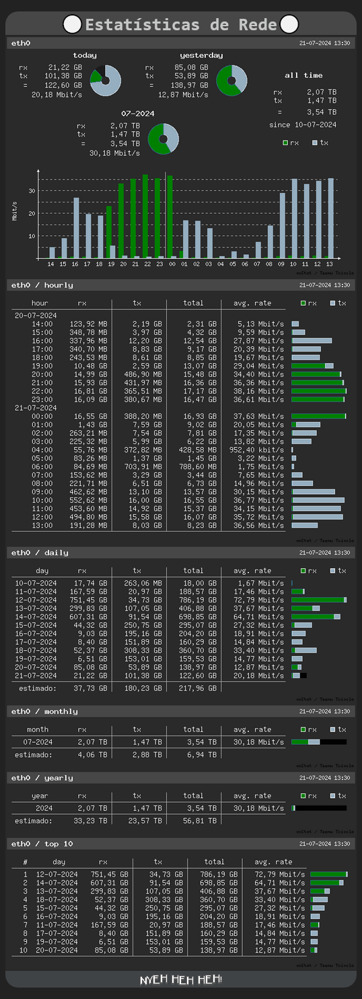

# VnStati Web Page🔹
Web Page Para estatisticas do VnStat 
VnStat é uma ferramenta de monitoramento de tráfego de rede baseada em console para Linux e BSD. Ele manterá um registro do tráfego de rede para interfaces de rede selecionadas, criará logs e o vnStat usará as informações fornecidas pelo kernel. 

# Dependencias
✅Certifique-se de que <CODE>vnstat</CODE>e <code>vnstati</code>estejam instalados e configurados.  
#### :trophy: Instalaçao em Debian e similares:
```    
sudo apt install vnstat vnstati
```
 > [!NOTE]
>Testado no Raspberry 4 rodando **"Debian GNU/Linux 12 (bookworm)"**  
## Como usar este repositório?
*  **Clone este repositorio em** <code> > /var/www/html/</code>
```   
git clone git@github.com:Ser4ph4/VnStati-Web-Page.git vnstati 
```
 ⚠️No mesmo caminho de permissão de *ROOT*  

Modifique o <code>vnstati.sh</code>  com o nome da interface de rede (voçe pode listar suas interfaces com o comando : <code>*ip a*</code>no terminal)   


---------------
## Configurar o CronJob para executar o Script .SH

* Atualize o cron job para que gere as imagens com intervalo de 10 minutos. No terminal :  <code>sudo crontab -e</code> e adicione a seguinte linha no final do arquivo <code> /10 * * * * /var/www/html/vnstati/vnstati.sh </code>. Isso irá fazer com que o script rode a cada *10 minutos* gerando novas imagens as imagens Voce pode definar um timer maior de sua preferencia>*(https://crontab.guru/,  "Site do CRONS exemplos") )* .  
Para acessar seu painel de estatisticas > <code>http://localhost/vnstati</code>ou <code>http://<server-ip>/vnstati</code>para visualizar a página. 
### 游둰勇뀹creenshots
# No PC:   

# No Mobile:  

***
